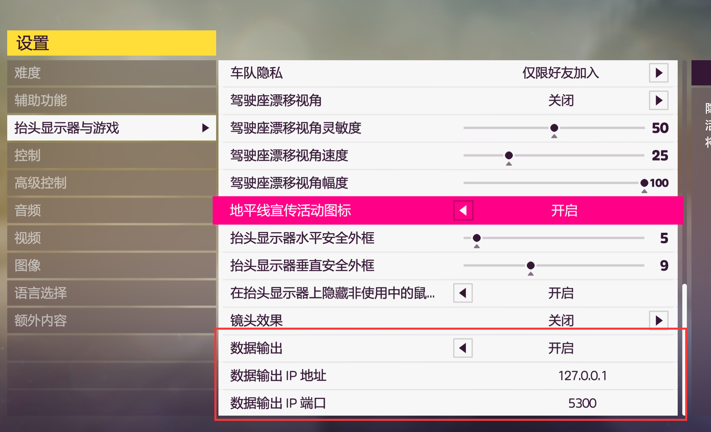
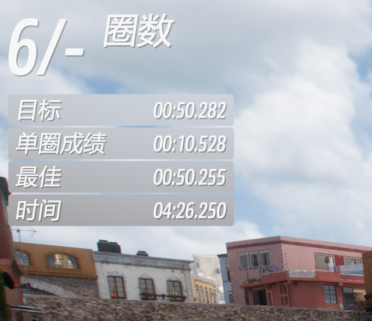
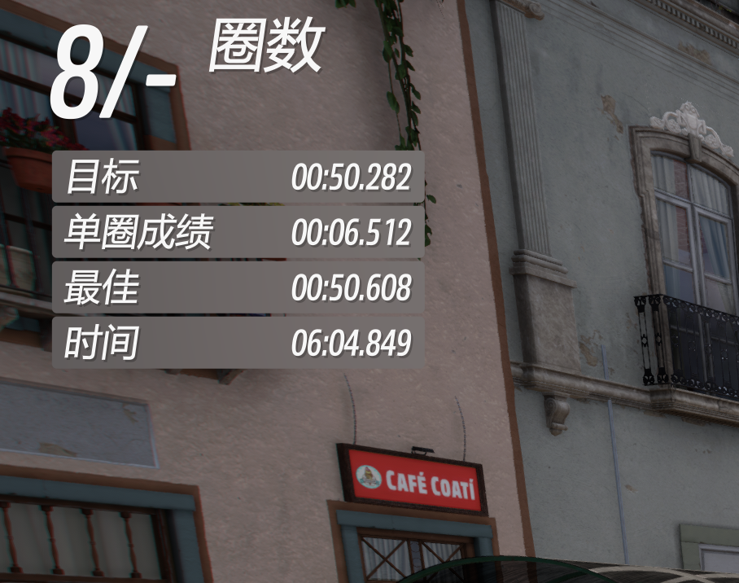

# forza-MT-auto
## 更新日志
每辆车的数据会在car文件夹里的record_车辆编号.json  
也就是说如果你调试好的一辆车 切回来的时候回自动读取进行分析  
注意离合时机和是否降档补油是统一配置的 json里是起跑数据而已 现场分析  

argsolver.py里可以改键  
降档补油参数也在argsolver.py里  
离合按键映射也在argsolver.py里  
手离换挡时机也在argsolver.py里  
还有好多自己去里面看一下 直接改default的值就行了
```
parser.add_argument('--clutch', type=str, help='离合按键',default="i")
parser.add_argument('--upgear', type=str, help='升档',default="e")
parser.add_argument('--downgear', type=str, help='降档',default="q")
parser.add_argument('--clutchBefore', type=float, help='踩下离合到换挡的延迟(秒)',default=0.1)
parser.add_argument('--clutchAfter', type=float, help='换挡到抬起离合的延迟(秒)',default=0.1)
parser.add_argument('--downGearCoolDown', type=float, help='降档的cd 连续降档间隔时长',default=0.5)
parser.add_argument('--upGearCoolDown', type=float, help='升档的cd 连续升档间隔时长',default=1)
parser.add_argument('--playerCoolDown', type=float, help='玩家介入换挡后程序发呆的时间',default=5)
parser.add_argument('--accelAfterGearDown', type=float, help='降档补油时长 0是关闭',default=0)
parser.add_argument('--accelKey', type=str, help='油门按键',default='w')
```

## 使用方法
[b站演示](https://www.bilibili.com/video/BV1fM4y1F7R8/)  
自动操控你的手动挡车车 支持手动和手离 有着更快的速度
使用方法  
1.开启数据输出

2. 启动应用  
安装python 3.8(python官网下载 或者下载anaconda3 64-bit) 然后命令行敲  
python keyboardloop.py  
如果报缺少包的话就pip install [缺少的包名]   
一般来说执行一下 
```
pip install argparse pynput numpy matplotlib ctypes pywin32 pyyaml
```
差不多能装好 要是报错了就一个一个装  
有可能会报网络相关的错误 这时候用清华源试试  
后面的那个pynput换成你想装的包  
pip install -i https://pypi.tuna.tsinghua.edu.cn/simple pynput  
3.选一辆你要开的车子 找个高速或者机场 开到手动挡挂1档就位  
4.按f10 此时应用会提示
```
listening on port 5300
ready!!
```
5.直线加速手动换挡一直加速到最高档 程序会记录你换挡时车辆的性能参数    
比如6档变速箱就直线加速从1档到6档 挂上6档之后就可以再按一次f10    
此时应用会对数据进行分析    
6.按f9即可应用f10调试出来的换挡数据  有本地缓存在/cars/record_{车辆id}.json里会默认读取你最后一次调试的换挡参数  
7.f9按一下开再按一下关 f10按一下开录制再按一下录制结束 f9和f10不能同时开(todo 后续兼容同时)  
8.开车!你会发现你的手动挡也可以自动换挡了(需要保持键盘q e降档升档键位 argsolver.py里改键)  

## 其他
1.默认是手动的 想要手离f9换成按f8就行
2.手离细节可以找listen.py里的 
```
upGearHandle 部分
```

##效果对比  
劲敌教堂 第六元素 同样调教 手动(auto)50.225 & 自动50.608


劲敌直线加速 第六元素 同样调教 手动(auto)23.953 & 自动24.115


## 下面是fork来的仓库 已经改的七七八八了 主要提供了数据接口的协议

# forza_motorsport
Various utilities to work with data from the Forza Motorsport and Forza Horizon games' data stream.

## fdp.py
A Python class containing all properties available in the data packets sent by the game's "data out" stream. This class supports packets for the original "sled" format in Forza Motorsport, the newer "dash cam" format, as well as the format in Forza Horizon 4.

## data2file.py
A script that will listen on a given port on the local machine and write any incoming packets to a given output file whenever the game is in a "race" state. The script runs until it is interrupted (e.g. by the Ctrl-C keyboard combination).

### TSV output example

Say that we want to store our data in a file called `forza_data.tsv`. We can start the Python script as follows, where it will listen on port 1123 and write to the file we want:

```
python data2file.py 1123 forza_data.tsv
```

Next, you will have to go into the HUD options in the game and at the bottom set "data out" to "ON", the "data out IP address" to the IP address of your machine (how to find that depends on your system, refer to your user manual), and the "data out IP port" to 1123.

Once you're in a race the script will start writing data to the TSV. To stop the script, hit Ctrl-C.

### File formats supported

The script supports writing out tab-separated or comma-separated values. Supply the `-f` or `--format` parameter to the script to control the format. It writes out tab-separated values by default.

Say you want to write out a comma-separated file to import into Excel, add the format parameter:

```
python data2file.py -f csv 1123 forza_data.csv
```

### Overwrite or append to the output file

By default the script will overwrite an existing file, and start the file by writing out a row with the names of all the data properties found in the data packets transmitted by the game. If you instead want to append data to an existing file, supply the `-a` parameter:

```
python data2file.py -a 1123 forza_data.tsv
```

When appending, the header row is not written out as it is expected to already be present in the file.

### Write output in the older "sled" format

By default the script expects data packets to use the current "dash cam" format of Forza Motorsport 7. However, we still support the first version of the data out feature, the so-called "sled" format. If you want to use that format, supply the `-p` parameter to the script with a value of "sled", like this:

```
python data2file.py -p sled 1123 forza_data.tsv
```

We also support the Forza Horizon 4 data format, which we've labelled "fh4":

```
python data2file.py -p fh4 1123 forza_data.tsv
```

### Specify a configuration file

The utility script can read in a YAML configuration file, which allows you to specify what data you want logged, rather than have it log all available data. If you want to use a configuration file, supply the `-c` parameter to the script, with a value of the name of the configuration file, for example:

```
python data2file.py -c example_configuration.yaml 1123 forza_data.tsv
```

For more information about the configuration file format and the possible options, see the [configuration file documentation](configuration_file.md).

### Command line help

If you want to know what command line parameters you can use with the script, start it with `-h`. The script will then output some helpful information and how it works.

### Contributions are welcome

If you know Python and wish to contribute code, please don't hesitate to submit a pull request! There are always ways to improve, be it adding features or fixing bugs.
